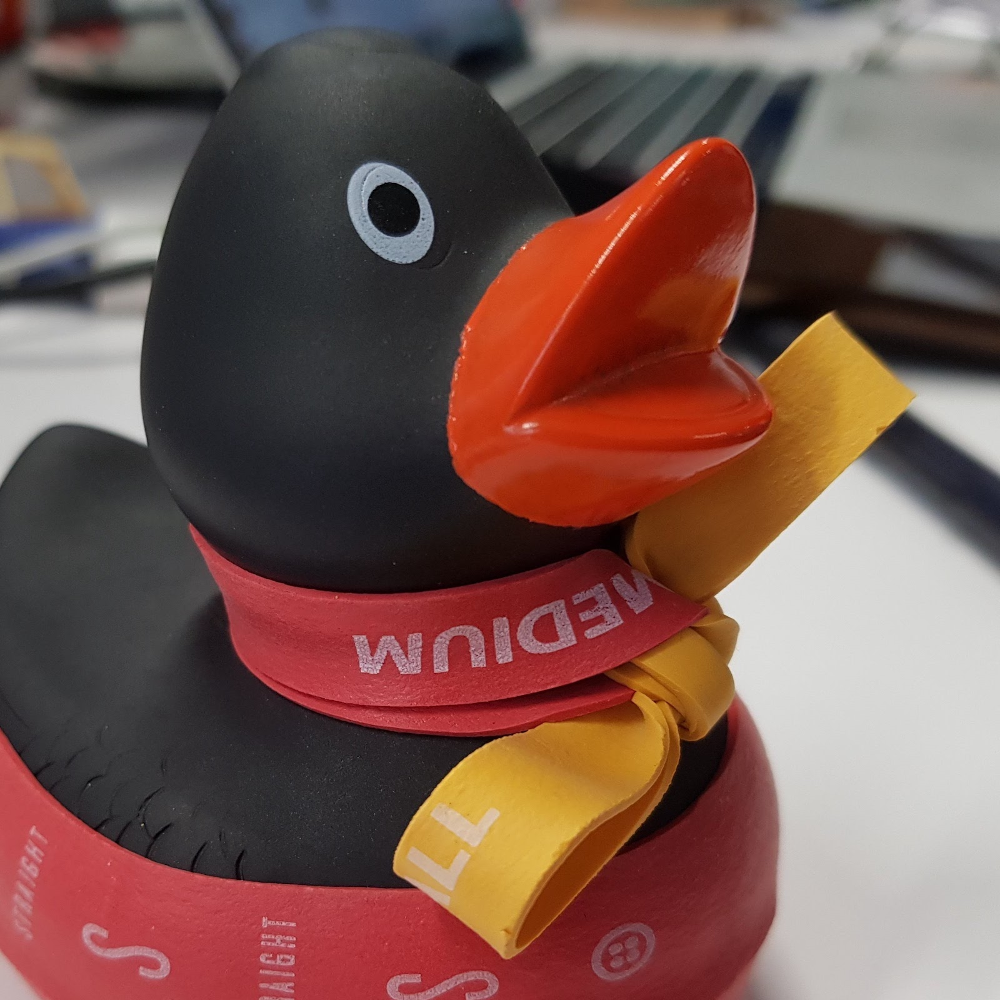

## This is a page at docs/a-sub-page.

- This should be a [download link, ducky_square_1.jpeg](ducky_square_1.jpeg)
- This should be a [download link, /ducky_square_1.jpeg](/ducky_square_1.jpeg)
- This should be a [download link, ./ducky_square_1.jpeg](./ducky_square_1.jpeg)
- This should be a [download link, /docs/ducky_square_1.jpeg](/docs/ducky_square_1.jpeg)

There should be an image here:

[filename](https://www.youtube.com/embed/4HlNv1qpZFY ':include :type=frame')

<iframe width="560" height="315" src="https://www.youtube.com/embed/4HlNv1qpZFY" title="YouTube video player" frameborder="0" allow="accelerometer; autoplay; clipboard-write; encrypted-media; gyroscope; picture-in-picture" allowfullscreen></iframe>

Test pdf link:
[Test PDF](/assets/dummy.pdf ':target=_self') 