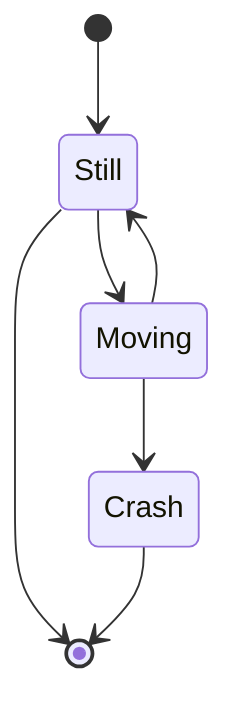
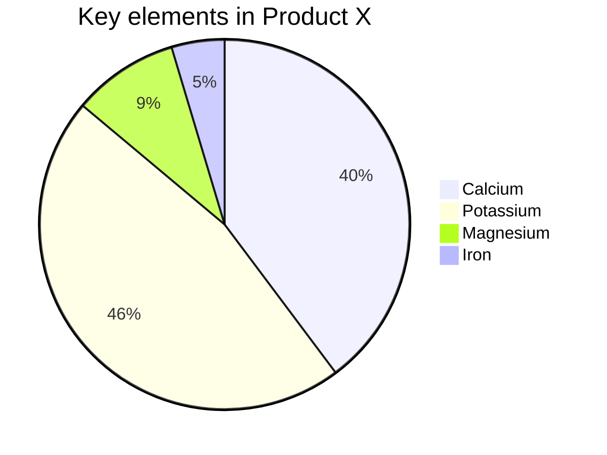

# Get started
Here is how to get started
# Get started
Here is how to get started
## Mermaid

Test pdf link:
- [View Terms of Use v 3.6.2](./terms-of-use.pdf ':target=_blank') 
- [View Privacy Policy v 2.7.2](../../../privacy-policy-v-2.7.2.pdf ':target=_blank') 
- [View Acceptable Use Poilcy v 4.0](../../../mdm-aup-v4.0.pdf ':target=_blank') 
- [Worst PDF naming ever](../../../assets/Random%20Naming%20Style%201%20.%202%203.4.pdf ':target=_blank') 

- [Worst PDF naming ever](../../../assets/Random%20Naming%20Style%201%20.%202%203.4.pdf ':target=_blank :class="test-class" :title="abc"' ':class="test-class"' ':title="abc"') 

Test webhook update

- <a href="./terms-of-use.pdf" target="_blank">View Terms of Use v 3.6.2</a> 
- <a href="terms-of-use.pdf" target="_blank">View Terms of Use v 3.6.2</a> 
- <a href="/privacy-policy-v-2.7.2.pdf" target="_blank">View Privacy Policy v 2.7.2</a>
- <a href="../../../mdm-aup-v4.0.pdf " target="_blank">View Acceptable Use Poilcy v 4.0</a>
- <a href="/assets/Random Naming Style 1 . 2 3.4.pdf" target="_blank">View Acceptable Use Poilcy v 4.0</a>