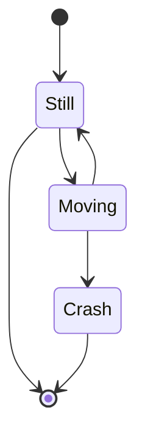
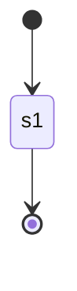
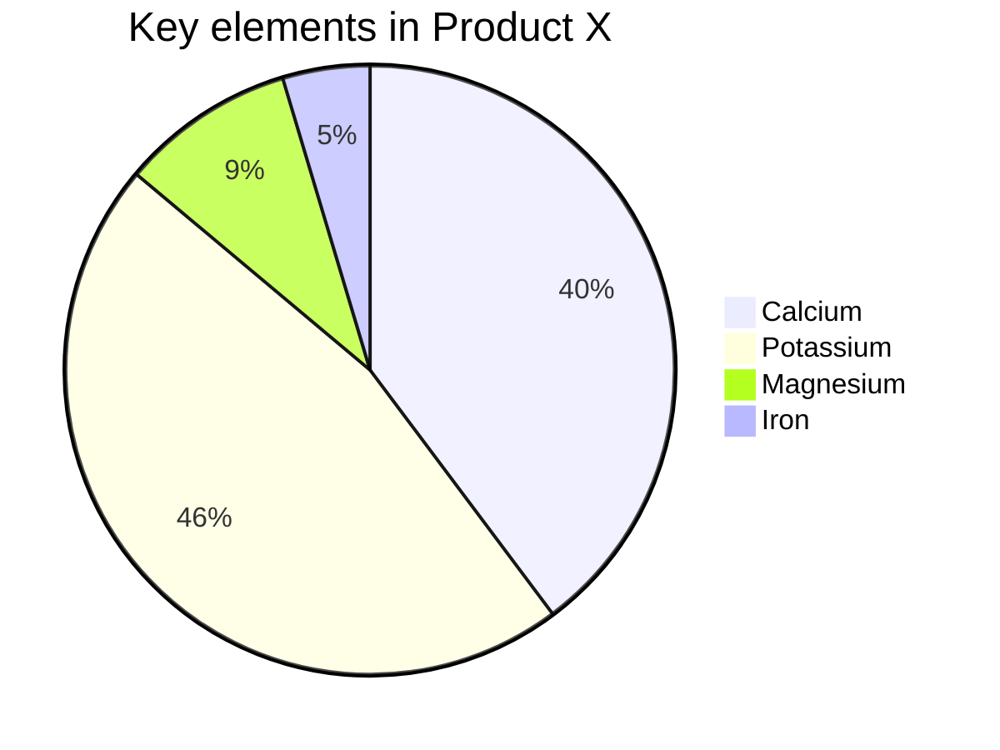

# Get started
Here is how to get started
# Get started
Here is how to get started
## Mermaid

Test pdf link:
- [View Terms of Use v 3.6.2](../../terms-of-use.pdf ':target=_blank') 
- [View Privacy Policy v 2.7.2](../../privacy-policy-v-2.7.2.pdf ':target=_blank') 
- [View Acceptable Use Poilcy v 4.0](../../mdm-aup-v4.0.pdf ':target=_blank') 
- [Worst PDF naming ever](../../assets/Random%20Naming%20Style%201%20.%202%203.4.pdf ':target=_blank') 

Test docsify links:
- [docsify-style #get-started ](#get-started)
- [docsify-style ./level-one-sub-page.md ](./level-one-sub-page.md)
- [docsify-style /docs_1/docs/levelone/level-one-sub-page.md?id=an-image](/docs_1/docs/levelone/level-one-sub-page.md?id=an-image)
- [docsify-style /docs_1/docs/levelone/level-one-sub-page.md#an-image](/docs_1/docs/levelone/level-one-sub-page.md#an-image)
- [docsify-style #mermaid](#mermaid)

Test anchor links:
- <a href="#get-started">anchor tags e.g., a hrefs #get-started</a>
- <a href="./level-one-sub-page.md">anchor tags e.g., a hrefs ./level-one-sub-page.md</a>
- <a href="/docs_1/docs/levelone/level-one-sub-page.md?id=an-image">anchor tags e.g., a hrefs /docs_1/docs/levelone/level-one-sub-page.md?id=an-image</a>
- <a href="/docs_1/docs/levelone/level-one-sub-page.md#an-image">anchor tags e.g., a hrefs /docs_1/docs/levelone/level-one-sub-page.md#an-image</a>
- <a href="#mermaid">anchor tags e.g., a hrefs #get-started</a>
  

Test webhook update

<a href="/terms-of-use.pdf" target="_blank">View Terms of Use v 3.6.2</a>
<a href="/privacy-policy-v-2.7.2.pdf" target="_blank">View Privacy Policy v 2.7.2</a>
<a href="/mdm-aup-v4.0.pdf " target="_blank">View Acceptable Use Poilcy v 4.0</a>
<a href="/assets/Random Naming Style 1 . 2 3.4.pdf" target="_blank">View Acceptable Use Poilcy v 4.0</a>